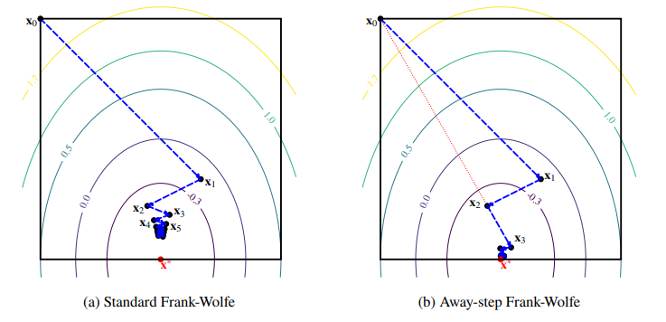

# How does it work?

`FrankWolfe.jl` contains generic routines to solve optimization problems of the form

```math
\min_{x \in \mathcal{C}} f(x)
```

where $\mathcal{C}$ is a compact convex set and $f$ is a differentiable function.
These routines work by solving a sequence of linear subproblems:

```math
\min_{x \in \mathcal{C}} \langle d_k, x \rangle \quad \text{where} \quad d_k = \nabla f(x_k)
```

## Linear Minimization Oracles

The Linear Minimization Oracle (LMO) is a key component, which is called at each iteration of the FW algorithm. Given a direction $d$, it returns an optimal vertex of the feasible set:

```math
v \in \argmin_{x\in \mathcal{C}} \langle d,x \rangle.
```


### Pre-defined LMO for key feasible sets

Several common implementations of LMOS s are available out-of-the-box:

- **simplices**: unit simplex [`FrankWolfe.UnitSimplexLMO`](@ref) , probability simplex [`FrankWolfe.ProbabilitySimplexLMO`](@ref);
- **balls** in various norms [`FrankWolfe.LpNormLMO`](@ref);
- **polytopes**: K-sparse [`FrankWolfe.KSparseLMO`](@ref) , Birkhoff [`FrankWolfe.BirkhoffPolytopeLMO `](@ref).
  
See [Combettes, Pokutta (2021)](https://arxiv.org/abs/2101.10040) for references on most LMOs implemented in the package and their comparison with projection operators.

### The MathOptLMO
You can use an oracle defined via a Linear Programming solver (e.g. `SCIP` or `HiGHS`) with [MathOptInferface](https://github.com/jump-dev/MathOptInterface.jl): see [`FrankWolfe.MathOptLMO`](@ref).

### Wrapper to combine LMOs
We provide wrappers to combine oracles easily, for example [`FrankWolfe.ProductLMO`](@ref) for product of oracles or [`FrankWolfe.SubspaceLMO`](@ref) for projections composed with oracles.

### User-defined LMOs
If you want use your own custom LMO `MyLMO` in the algorithms provided here, it
is required that
* `MyLMO` be a subtype of [`FrankWolfe.LinearMinimizationOracle`](@ref);
* the method `FrankWolfe.compute_extreme_point` (see below) be defined and minimize $v \mapsto \langle d, v \rangle$ over the set $\mathcal{C}$ defined by the custom LMO `MyLMO`.
```julia
FrankWolfe.compute_extreme_point(lmo::MyLMO, direction; v, kwargs...) -> v
```

Note that the constraint set $\mathcal{C}$ defined by `MyLMO` doesn't have to be represented explicitly, e.g., as a set of inequalities.
Indeed, all we need is to minimize a linear function over $\mathcal{C}$, which does not necessarily require an explicit representation of $\mathcal{C}$.
Even black box minimization procedures can be considered!


## Optimization algorithms

The package features several variants of Frank-Wolfe that share the same basic API.

Most of the algorithms listed below also have a lazified version: see [Braun, Pokutta, Zink (2016)](https://arxiv.org/abs/1610.05120).

### Standard Frank-Wolfe (FW)

It is implemented in the [`frank_wolfe`](@ref) function.

See [Jaggi (2013)](http://proceedings.mlr.press/v28/jaggi13.html) for an overview.

This algorithm works both for convex and non-convex functions (use step size rule `FrankWolfe.Nonconvex()` in the second case).

### Away-step Frank-Wolfe (AFW)

It is implemented in the [`away_frank_wolfe`](@ref) function.

See [Lacoste-Julien, Jaggi (2015)](https://arxiv.org/abs/1511.05932) for an overview.

### Stochastic Frank-Wolfe (SFW)

It is implemented in the [`FrankWolfe.stochastic_frank_wolfe`](@ref) function.

### Blended Conditional Gradients (BCG)

It is implemented in the [`blended_conditional_gradient`](@ref) function, with a built-in stability feature that temporarily increases accuracy.

See [Braun, Pokutta, Tu, Wright (2018)](https://arxiv.org/abs/1805.07311).

### Pairwise Frank-Wolfe (PFW)

It is implemented in the [`pairwise_frank_wolfe`](@ref) function.
See [Lacoste-Julien, Jaggi (2015)](https://arxiv.org/abs/1511.05932) for an overview.

### Blended Pairwise Conditional Gradients (BPCG)

It is implemented in the [`FrankWolfe.blended_pairwise_conditional_gradient`](@ref) function, with a minor [modification](https://hackmd.io/@spokutta/B14MTMsLF) to improve sparsity.

See [Tsuji, Tanaka, Pokutta (2021)](https://arxiv.org/abs/2110.12650)

### Corrective Frank-Wolfe (CFW)

It is implemented in the [`FrankWolfe.corrective_frank_wolfe`](@ref) function and generalizes multiple Frank-Wolfe algorithms which alternate between FW steps and steps based on the active set (e.g., away step, blended pairwise steps, ...).

### Comparison

The following table compares the characteristics of the algorithms presented in the package:

| Algorithm | Progress/Iteration | Time/Iteration | Sparsity | Numerical Stability | Active Set | Lazifiable |
| :-: | :-: | :-: | :-: | :-: | :-: | :-: |
| **FW** | Low | Low | Low | High | No | Yes |
| **AFW** | Medium | Medium-High | Medium | Medium-High | Yes | Yes |
| **B(P)CG** | High | Medium-High | High | Medium | Yes | By design |
| **SFW** | Low | Low | Low | High | No | No |

While the standard Frank-Wolfe algorithm can only move _towards_ extreme points of the compact convex set $\mathcal{C}$, Away-step Frank-Wolfe can move _away_ from them. The following figure from our paper illustrates this behaviour:

.

Both algorithms minimize a quadratic function (whose contour lines are depicted) over a simple polytope (the black square). When the minimizer lies on a face, the standard Frank-Wolfe algorithm zig-zags towards the solution, while its Away-step variant converges more quickly.


### Block-Coordinate Frank-Wolfe (BCFW)

It is implemented in the [`FrankWolfe.block_coordinate_frank_wolfe`](@ref) function.

See [Lacoste-Julien, Jaggi, Schmidt, Pletscher (2013)](https://arxiv.org/abs/1207.4747)
and [Beck, Pauwels, Sabach (2015)](https://arxiv.org/abs/1502.03716) for more details about different variants of Block-Coordinate Frank-Wolfe.

### Alternating Linear Minimization (ALM)

It is implemented in the [`FrankWolfe.alternating_linear_minimization`](@ref) function.

### Difference of Convex Algorithm with Frank-Wolfe (DCA-FW)

It is implemented in the [`FrankWolfe.dca_fw`](@ref) function.
